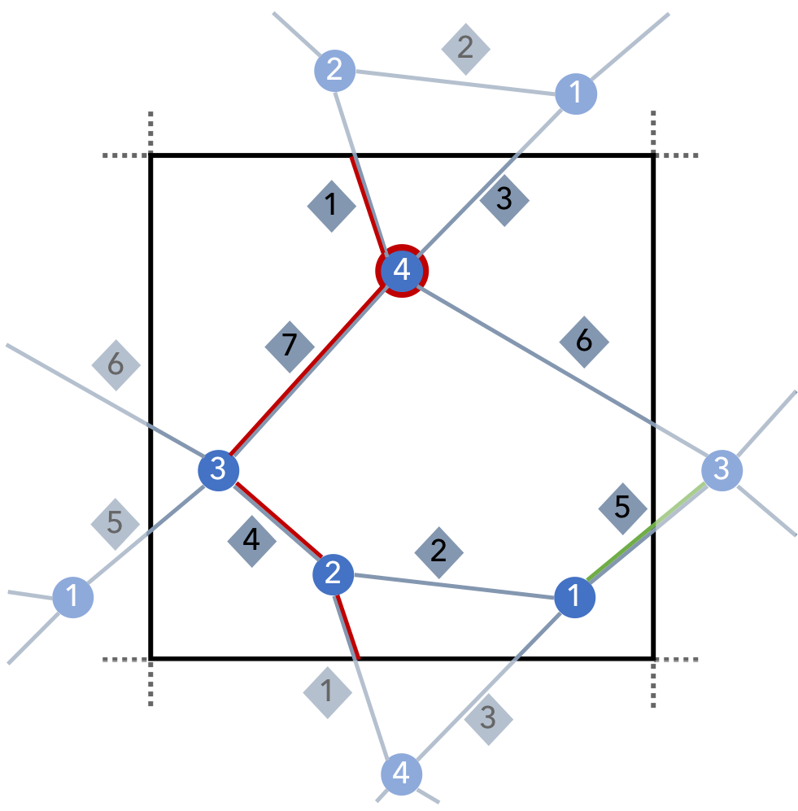

A simple example
================

Consider the periodic net below, with only 4 nodes and 7 bonds. Each node has at one or two bonds that remain within the unit cell, and
one or two bonds that cross a boundary. The example is twodimensional to facilitate visualization, but the code
below includes 3 dimensions for all boundary-crossing vectors so the example can be more easily translated to a 3D setting.

.. literalinclude:: ../../examples/simple.py
    :language: python
