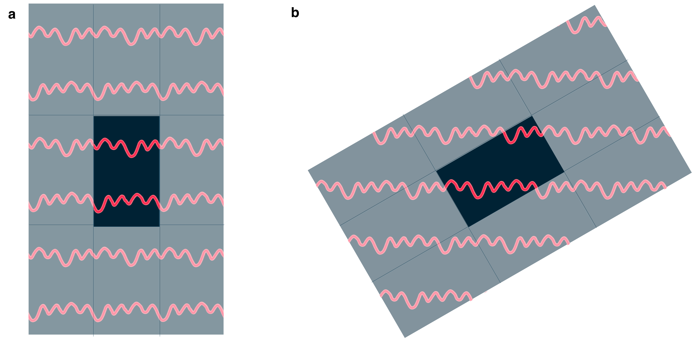
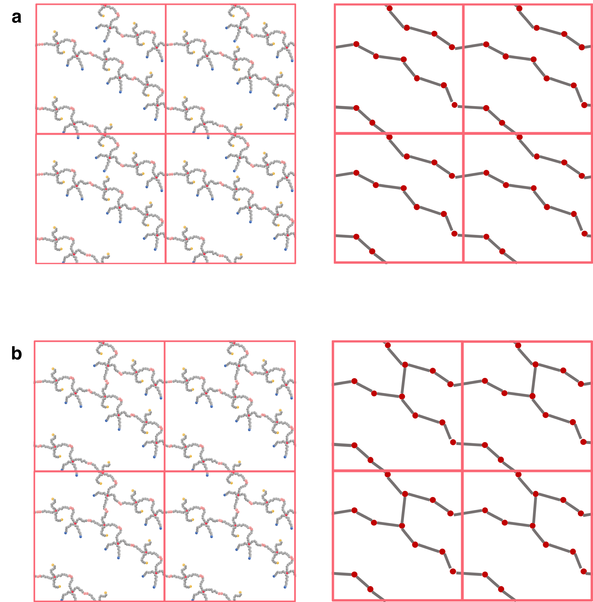

When and why to use
===================

The properties of structures defined using a `unit cell` or `box with periodic boundaries` depend
crucially on whether those structures do or do not connect to themselves across the periodic
boundaries. When the structures are somehow disordered, the task of determining whether a
structure does this can become nontrivial, regardless whether the data is computer-generated or
the result of an experiment.

When the structures do connect to themselves accross a boundary, this is called `percolation`. Its 
relevance becomes clear when the unit cell is repeated many times in all directions, because percolating
structures then become infinitely large structures. Often the answer is clear-cut and there is either no
percolation or percolation in all directions. But the edge cases can be nontrivial to analyse. **perconet**
employs a loop-finding algorithm that covers these edge cases correctly. Obviously the easier cases can
also be analyzed using **perconet**.

A more detailed motivation for our work will be published soon. In summary, consider the following graphic
that shows the same perodic structure, but with two different choices for the unit cell. This graphic shows
that a simple analysis in which the two lattice directions are considered separately cannot cover all cases
correctly. From the unit cell on the left, one would conclude that this network percolates only in the
x-direction, while the unit cell on the right suggests that it percolates in both x- and y-directions.

The correct answer here is that this structure only percolates in a single direction. To get the correct
answer regardless of the choice of unit cell, **perconet** employs an algorithm that finds the loops
in the periodic structure (called a periodic `net` or `network` or `graph`) that start from some site 
in the network and go around one or several of the boundaries to end up at the same site.

If your data is complex, like the samples from a polymer simulation below, it may be useful to reduce your
network to its essential backbone, as shown below. Tools to do this in an automated fashion for e.g. LAMMPS
simulation data are being developed.

This example shows that a single added bond in the network can make the difference between a network that 
percolates in only one direction vs. two.

.. _Loop independence:

Loop independence
-----------------

If the loop finder identifies a loop that goes around both the :math:`+x` and :math:`+y`
boundaries :math:`\left[\vec{b}_1=(1,1,0)\right]`, and another loop that only goes around the :math:`+x`
boundary :math:`\left[\vec{b}_2=(1,0,0)\right]`, we can construct a loop with :math:`\vec{b}=(0,1,0)` by first
going around the first loop and then going around the second loop in reverse: :math:`\vec{b}=\vec{b}_1-\vec{b}_2`.
Generalizing, any linear combination of loops with integer coefficients is also a loop. Thus it makes
sense to reduce the list of loops to a list of `independent` loops by constructing a basis
of independent loops. Because the basis is to be used only with integer coefficients (one cannot
go around a loop half a time), it is a lattice basis and the space of allowed loops is a lattice.
Writing the list of loops as a matrix (each row representing a loop), the reduction is like gaussian
elimination, but with the constraint that only integer multiples of loops can be added to other
loops and multiplying a row by a constant is not allowed (except for -1 which is just reversing the
direction of a loop).

A way of reducing the list of loops to a list of independent loops that gives a unique result, so
one can compare different loop structures, is to cast it into Hermite normal form. See
`Wikipedia <https://en.wikipedia.org/wiki/Hermite_normal_form>`_ or your favorite linear algebra text
for details. This is the form :py:meth:`perconet.LoopFinder.get_independent_loops` returns. Note that
the exact definition of Hermite normal form varies slightly between authors.